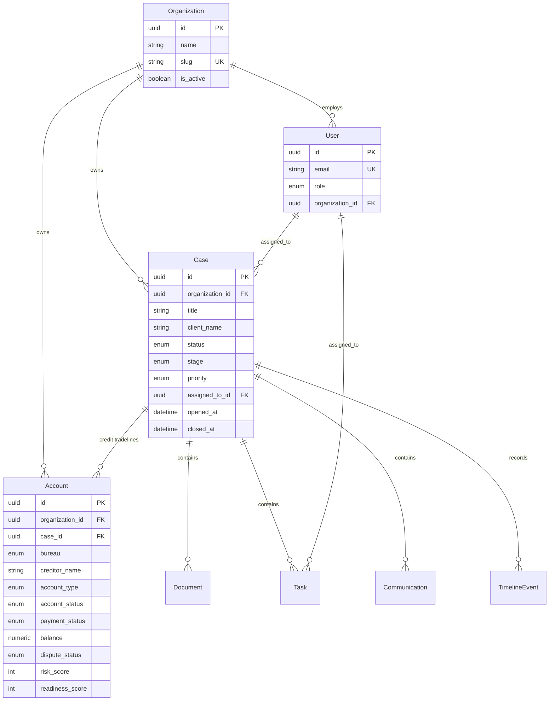

# Data Model

Persistence design, entity relationships, and lifecycle conventions. Complements the [Domain Model](domain-model.md) and [database ERD](../database/erd.md).

## Global conventions

| Rule          | Detail                                                      |
| ------------- | ----------------------------------------------------------- |
| Primary keys  | UUID (`uuid.uuid4`), PostgreSQL `UUID` type                 |
| Timestamps    | `created_at`, `updated_at` — `DateTime(timezone=True)`, UTC |
| Soft delete   | `deleted_at` nullable; queries filter `deleted_at IS NULL`  |
| Audit         | `created_by_id`, `updated_by_id` → `users.id`               |
| Multi-tenancy | `organization_id` on all tenant-owned business rows         |
| Money         | `Numeric(12, 2)` for balances and amounts                   |
| Enums         | PostgreSQL native enums; Python `StrEnum` in models         |

Mixins: `TimestampMixin`, `SoftDeleteMixin`, `AuditMixin` in `api/core/audit.py`.

## Entity relationship (current — v4.3)



> **Note:** The legacy `cases.account_id → accounts` relationship (client company model) was removed in migration `003_credit_accounts`. Accounts now belong to cases via `accounts.case_id`.

## Entity lifecycles

### Case

| Stage          | Typical trigger                                   |
| -------------- | ------------------------------------------------- |
| Created        | Intake form / API POST                            |
| Stage advanced | Manual update or workflow rule (4.5)              |
| Closed         | Status → `resolved` or `closed`; sets `closed_at` |
| Soft deleted   | Admin DELETE; hidden from lists                   |

### Account (tradeline)

| Stage           | Typical trigger                                               |
| --------------- | ------------------------------------------------------------- |
| Created         | Manual entry or import job (4.5)                              |
| Scores computed | Service calls `apply_account_intelligence()` on create/update |
| Dispute sent    | `dispute_status` → `dispute_sent`; sets `last_dispute_date`   |
| Soft deleted    | Admin DELETE                                                  |

### Document (planned full lifecycle)

```
uploaded → stored (MinIO) → queued OCR → classified → linked to accounts
```

### Task

```
pending → in_progress → completed | cancelled
```

## Indexing strategy

- Foreign keys indexed (`organization_id`, `case_id`, `assigned_to_id`)
- Filter columns indexed (`status`, `stage`, `bureau`, `dispute_status`, `risk_score`)
- Full-text search (5.0): PostgreSQL `tsvector` or dedicated search service for documents

## Migrations

- Location: `apps/api/alembic/versions/`
- Naming: `NNN_descriptive_name.py`
- Always reversible downgrade when feasible
- CI runs `alembic upgrade head` before integration tests

## Data retention & compliance (5.0)

Planned additions:

- `consent_records` — client consent history (CROA)
- `retention_policies` — per-org document retention rules
- `audit_events` — immutable append-only store (may partition from `timeline_events`)

Until 5.0, `TimelineEvent` + audit fields provide the audit baseline.

## Reporting views (4.8+)

Operational dashboards will use:

- Materialized views or read replicas for heavy aggregates
- Intelligence summary patterns established in `AccountRepository.get_intelligence_summary`

Do not query across organizations in reporting SQL — always parameterize `organization_id`.
