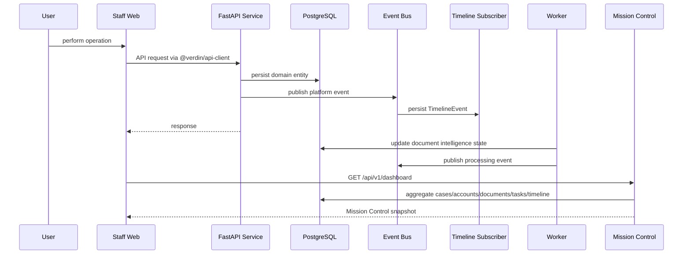
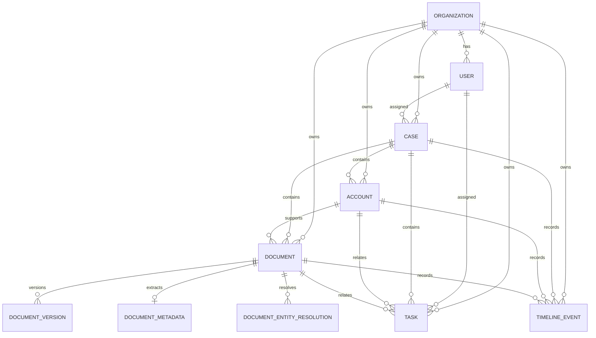

# Architecture Snapshot — v4.3.0 Operational Core

**Date:** 2026-06-29  
**Release:** `v4.3.0`  
**Purpose:** as-built reference for the stable Operational Core before Version 4.5 automation begins.

This snapshot records the architecture state at the point Version 4.3.0 is declared stable. Use it to compare future architecture changes, investigate regressions, and keep Version 4.5 automation work anchored to the shipped Operational Core contracts.

## Current Module Map

```text
apps/api/api/
├── core/                 shared config, auth helpers, permissions, events, pagination
├── database/             SQLAlchemy engine/session/base
├── modules/
│   ├── auth/             organizations, users, JWT login/refresh/me
│   ├── cases/            case CRUD, lifecycle, assignment, RBAC
│   ├── accounts/         credit tradelines, risk/readiness scoring, intelligence summary
│   ├── documents/        upload, versioning, OCR status, classification, metadata, resolution
│   ├── timeline/         append-only event stream and event-bus persistence
│   ├── tasks/            operational work queue, complete/reopen/delete, timeline events
│   └── dashboard/        Mission Control aggregation API
├── repositories/         legacy/shared repository adapters
└── versions/v1/          versioned API router

apps/worker/
└── worker/jobs/          OCR, classification, metadata extraction, entity resolution jobs

apps/web/src/
├── pages/                route-level React pages
├── components/           domain UI components and Mission Control widgets
├── routes/               protected route registration
└── lib/                  auth and client glue
```

Architecture rule: backend modules follow **router → service → repository → database**. Routers own HTTP concerns, services own business logic and RBAC, repositories own SQLAlchemy queries.

## Package Dependency Diagram

```mermaid
flowchart TD
    web[apps/web] --> apiClient[packages/api-client]
    web --> shared[packages/shared]
    web --> ui[packages/ui]
    web --> validation[packages/validation]

    api[apps/api] --> eventBus[packages/event-bus]
    api --> eventTypes[packages/event-types]
    api --> docClassification[packages/document-classification]
    api --> docMetadata[packages/document-metadata]
    api --> entityResolution[packages/entity-resolution]

    worker[apps/worker] --> eventBus
    worker --> eventTypes
    worker --> docClassification
    worker --> docMetadata
    worker --> entityResolution

    api --> postgres[(PostgreSQL)]
    api --> minio[(MinIO)]
    api --> redis[(Redis)]
    worker --> postgres
    worker --> minio
    worker --> redis
```



## Event Flow Diagram



Event consumers in 4.3.0:

- Timeline persistence
- Dashboard aggregation reads

Planned 4.5 consumers:

- Workflow automation
- Auto task generation
- Notifications
- AI assistant context assembly

## Database Entity Diagram



Global persistence conventions:

- UUID primary keys
- UTC timestamps
- `organization_id` on tenant-owned rows
- Soft delete on business entities where applicable
- Audit fields for created/updated actor where applicable

## API Surface Summary

Base URL: `/api/v1`

| Domain    | Endpoints                                                                                                       | Notes                               |
| --------- | --------------------------------------------------------------------------------------------------------------- | ----------------------------------- |
| System    | `GET /health`, `GET /version`                                                                                   | Public health/version               |
| Auth      | `POST /auth/login`, `POST /auth/refresh`, `GET /auth/me`                                                        | JWT access/refresh lifecycle        |
| Cases     | `POST/GET/PATCH/DELETE /cases`, `GET /cases/{case_id}`, `GET /cases/{case_id}/accounts`                         | Case CRUD and case account views    |
| Accounts  | `POST/GET/PATCH/DELETE /accounts`, `GET /accounts/{account_id}`, `GET /accounts/intelligence/summary`           | Tradeline intelligence              |
| Documents | `POST/GET/PATCH/DELETE /documents`, OCR retry/status, versions, download, metadata, entity resolution endpoints | Storage + intelligence pipeline     |
| Timeline  | `GET /timeline`, `GET /timeline/{id}`                                                                           | Append-only audit/activity stream   |
| Tasks     | `POST/GET/PATCH/DELETE /tasks`, `POST /tasks/{id}/complete`, `POST /tasks/{id}/reopen`                          | Operational work queue              |
| Dashboard | `GET /dashboard`                                                                                                | Mission Control product aggregation |

Mission Control response sections:

- `overview`
- `cases`
- `accounts`
- `documents`
- `timeline`
- `tasks`
- `processing`
- `performance`
- `alerts`

## Active ADR List

| ADR                                          | Title                                  | Status   |
| -------------------------------------------- | -------------------------------------- | -------- |
| [001](../adr/001-monorepo.md)                | Monorepo with pnpm and Turborepo       | Accepted |
| [002](../adr/001-monorepo.md)                | Layered backend architecture           | Accepted |
| [003](../adr/001-monorepo.md)                | UUID primary keys                      | Accepted |
| [004](../adr/001-monorepo.md)                | JWT with refresh tokens                | Accepted |
| [005](../adr/005-domain-modules.md)          | Domain-driven API modules              | Accepted |
| [006](../adr/006-api-versioning.md)          | URL-based API versioning               | Accepted |
| [007](../adr/007-quality-gates.md)           | Quality gates (pre-commit and CI)      | Accepted |
| [008](../adr/008-background-jobs.md)         | Redis-backed background jobs           | Accepted |
| [009](../adr/009-architecture-governance.md) | Architecture governance and V5 roadmap | Accepted |
| [010](../adr/010-capability-matrix.md)       | Platform capability matrix             | Accepted |

## Capability Matrix — v4.3.0

| Capability                  | Status | Notes                                           |
| --------------------------- | ------ | ----------------------------------------------- |
| Platform Foundation         | ✅     | Monorepo, auth, RBAC, CI, shared packages       |
| Case Management             | ✅     | CRUD, filters, RBAC, staff UI                   |
| Credit Account Intelligence | ✅     | Risk/readiness scoring and intelligence summary |
| Document Foundation         | ✅     | Upload, versioning, MinIO, duplicate detection  |
| OCR Pipeline                | ✅     | Async extraction and retry path                 |
| AI Classification           | ✅     | Rule-based classification framework             |
| Metadata Extraction         | ✅     | Structured document metadata extraction         |
| Entity Resolution           | ✅     | Deterministic matching and review flows         |
| Timeline & Audit Engine     | ✅     | Event bus + append-only timeline                |
| Task Management             | ✅     | CRUD, complete/reopen, filters, timeline events |
| Operational Dashboard       | ✅     | Mission Control, one aggregation endpoint       |

## 4.5 Architecture Guardrails

Version 4.5 features should build on this snapshot instead of rewriting it:

- Use cases, accounts, documents, timeline, tasks, and dashboard contracts as stable core primitives.
- Emit events for automation rather than directly coupling modules.
- Keep AI outputs traceable: source document, model/version or rules version, confidence, timestamp.
- Add workflow state around existing entities before adding new foundational entities.
- Record any significant deviations in ADRs before implementation.
